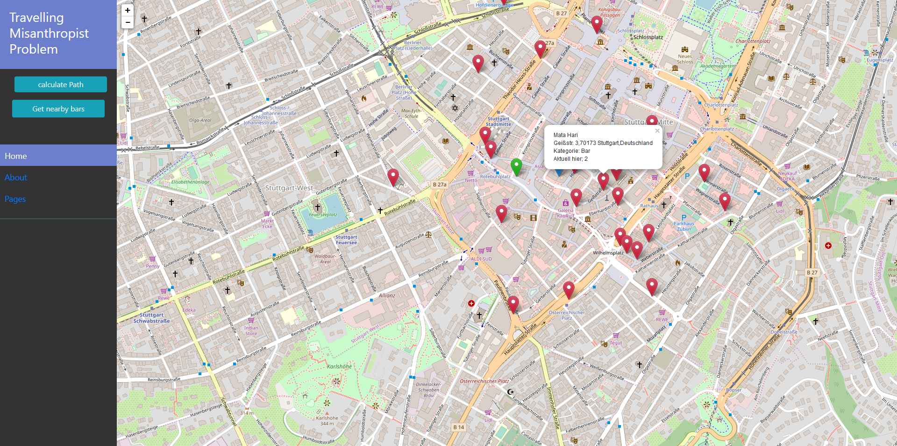
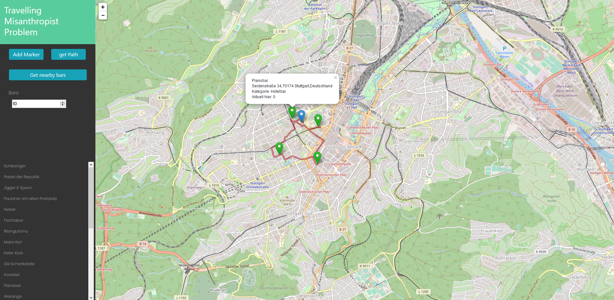
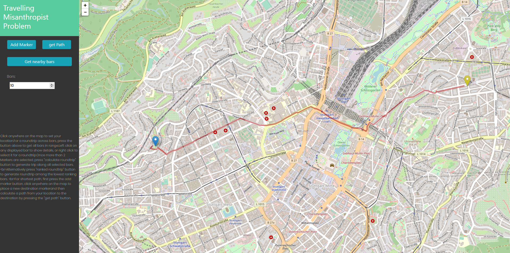

# TravellingMisanthropistProblem

Web application that, given a location, computes a round trip along nearby amenities based on a specified ranking.
As misanthropist, one might want to go for a roundtrip among nearby bars but also avoid being in crowded places, and people in general, whenever possible.
Thus, pick the bars with the lowest possiblity of being crowded.
Bars with a generaly low ranking should in theory be visited less.

This project is split into two git repositories
* [Parser](https://github.com/StraysWonderland/TMP_Parser)
* [(Springboot Web) Application](https://github.com/StraysWonderland/TravellingMisanthropistProblem)

Access the gitpitch-presentation about this project via button above, or via the [TMP_Pitch](https://github.com/StraysWonderland/TMP_Pitch) repository.

## PARSER
To run parser, place a pbf file in the root directory and name it 'target.osm.pbf'.
Run the jar file preferably by running the command:
   >  java -jar -Xmx=\<AllocatedRAM> \<JARNAME> \<name of pfb file>
   
*   \<JARNAME> should be TMPParser.jar, lying in the root of the directory
*   \<name of pbf file> should usually be 'ger.osm.pbf' or 'bw.osm.pbf' or define the path, if file lies somewhere else.
*   \<allocatedRam> shout at least be 16G

Example:
   >  java -jar -Xmx=20G TMPParser.jar ger.osm.pbf

Alternatively, launch intelliJ and run the application (set jav heapspace accordingly via Help -> customVMoptions -> Xmxs)

### Created Files
The parser will create to files under TMPParser\ressources.

*   Rename these files to 'de.osm.edges' and 'de.osm.nodes' (only if this is not already the case)
*   Copy the files to the project directory of the actual application and place them in TravellingMisanthropistProblem\ressources. 
(two already parsed files for stuttgart can be found here as well)

## HOW TO START THE PROJECT

### Method 1: IDE
open the 'TravelingMisanthropistProblem' Folder in IntelliJ-Idea and Run it.

### Method 2: JAR
To run the code from jar

*   open the 'TravelingMisanthropistProblem' Folder in Explorer,
*   Open cmd window in that Folder,
*   type and run following command:

    >  ./mvnw spring-boot:run -Drun.jvmArguments="-Xmx16G" -Drun.profiles=dev

## Using the Project
once the project has started, open a browser and navigate to 

   >  [http://localhost:8080/](http://localhost:8080/)

Either allow locating via gps or click anywhere on the map to set your current location.

### TSP
First, press the 'get nearby bars' button to retrieve nearby amenities.
A set of markers will be placed on the map.
Left click each marker to show a popup containing information about selected bar.
Right click a marker to select it as desired target of the roundtrip. 
Richt clicking shows following information about an amenity

Once you have selected more than one marker, you can press the now appearing 'calculate roundtrip' and the route will be displayed.

#### Ranked-TSP
instead of selecting bars by hand, use the 'ranked Roundtrip' button to generate a tour to the least visited bars, ranked via foursquare.
Specify the number of bars to visit by editing 'bars' input field.
Input any number from 2 to 23.

### Dijkstra
Place an additional marker via corresponding button, then press 'calculate path' to display the shortest path between both markers 

## Additional Notes
*   The project contains resource files to handle Baden-Würrtemberg.
*   If instead of germany, Stuttgart (already existing in the repo) should be used (when less ram is available), rename the existing files (in \./ressources) to 'de.osm.nodes' and 'de.osm.edges'.

## Implementation Details
*   Java for Backend
*   Leaflet for map visualisation
*   Javascript for map interaction
*   Java Springboot to bundle into web-application
*   Map-Data from OpenStreetMaps
*   Data for POIs from Foursquare API

## Project Goal and Problem Definition
### General procedure
*   Parse osm file to retrieve edges and node.
*   Read file and generate grid for fast access
*   Visualise map
*   Retrieve nearby amenities from [foursquare API](https://de.foursquare.com/)
*   Calculate dijkstra between two points
*   Calculate TSP for selected amenities.
*   Calculate TSP by selecting Bars with the lowest rating across all possible closeby bars.

### TSP
*   Calculation via [HeldKarp](https://en.wikipedia.org/wiki/Held%E2%80%93Karp_algorithm) -dynamic programming- algorithm

### Ranked TSP
*   Retrieves a set of properties such as 'users that are here now', 'user rating' ... from the foursquare API
*   Sorts retrieved amenities based on a rating generated from these properties (the lower the amount of people currently visiting, the better)
*   Calculate TSP along the 'top' k-bars, where top refers to those with the least possibility of being crowded.
